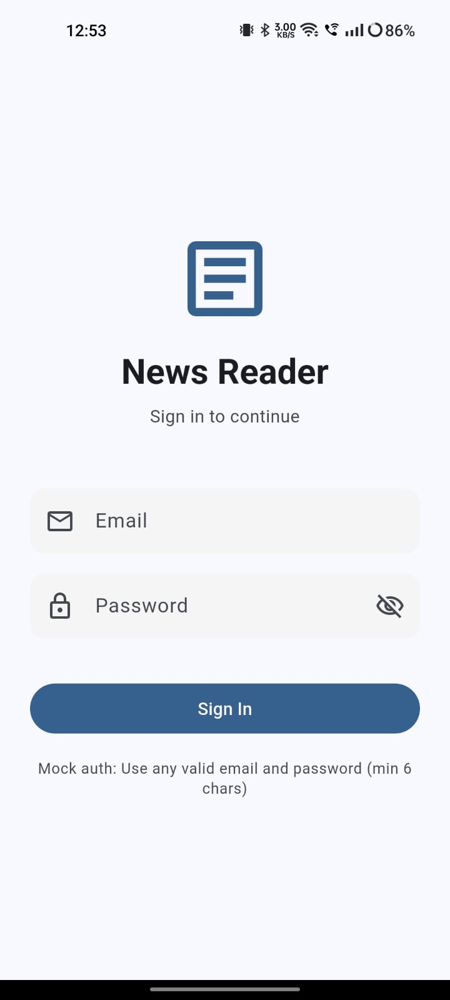
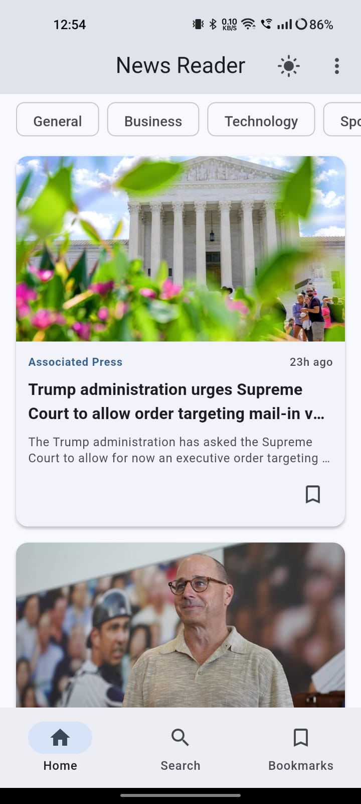
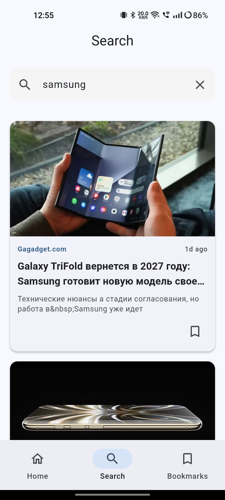
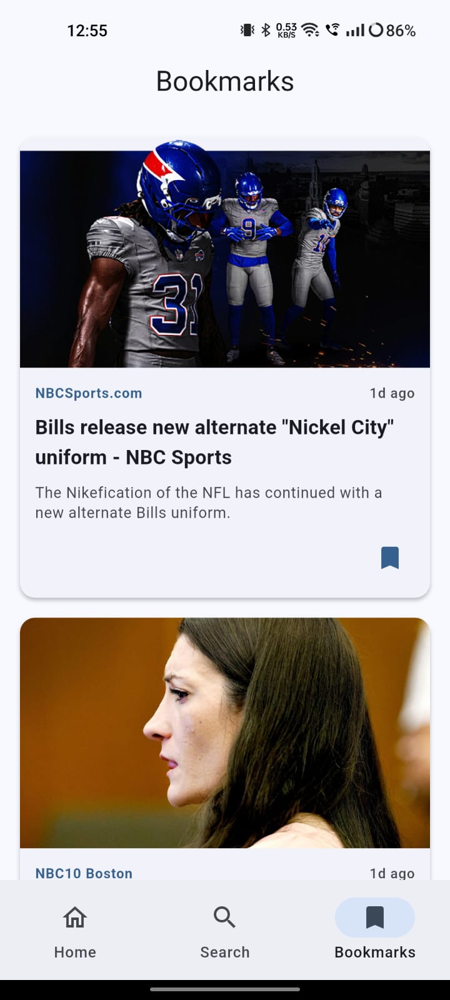
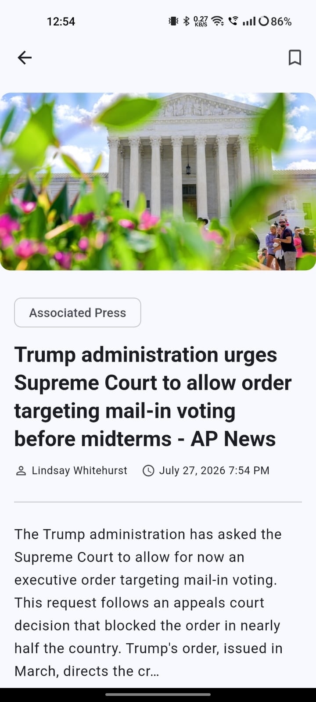
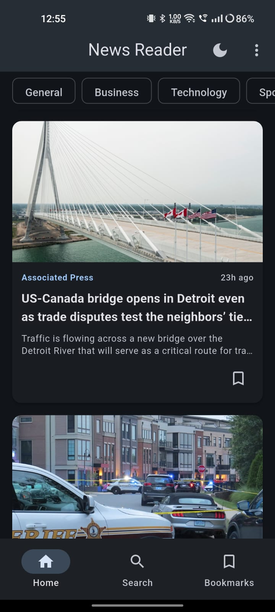
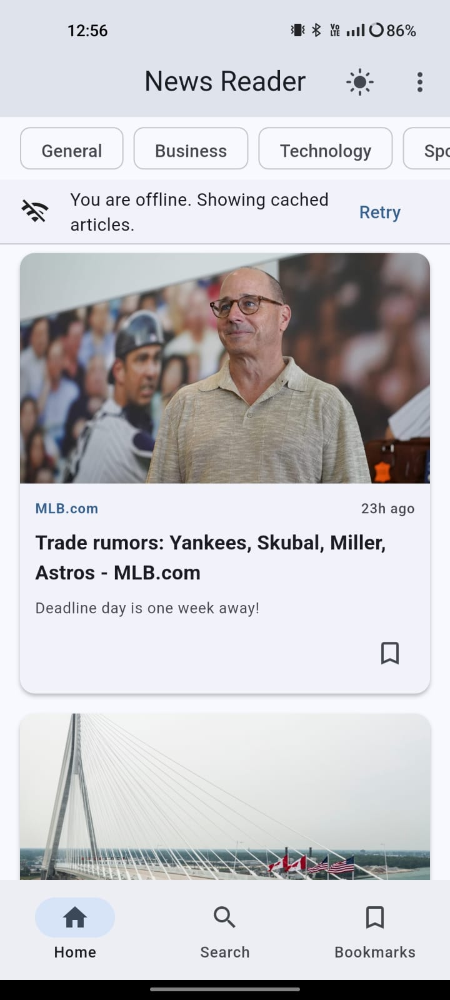

# News Reader Application

A modern, production-quality Flutter News Reader application with offline support, built using Clean Architecture principles.

## Project Setup

### Prerequisites

- Flutter SDK (latest stable version)
- Dart SDK
- Android Studio / VS Code with Flutter plugin

### Installation

```bash
# Clone the repository
git clone https://github.com/Himanshu4-Deshmukh/news_reader.git
cd news_reader

# Install dependencies
flutter pub get

# Run code generation (for Freezed models)
dart run build_runner build --delete-conflicting-outputs

# Run the application
flutter run
```

## Folder Structure

```
lib/
├── main.dart                          # App entry point
├── core/
│   ├── constants/
│   │   ├── api_constants.dart         # API endpoints & configuration
│   │   └── app_constants.dart         # App-wide constants
│   ├── errors/
│   │   └── app_exception.dart         # Custom exception classes
│   ├── router/
│   │   └── app_router.dart            # GoRouter configuration
│   ├── theme/
│   │   └── app_theme.dart             # Light/Dark theme definitions
│   └── utils/
│       └── network_info.dart          # Network connectivity utility
├── data/
│   ├── datasources/
│   │   ├── api_service.dart           # Dio HTTP client & API calls
│   │   └── local_storage_service.dart # Hive local storage wrapper
│   ├── models/
│   │   ├── article.dart               # Article & Source models (Freezed)
│   │   ├── news_response.dart         # API response model (Freezed)
│   │   └── user.dart                  # User model (Freezed)
│   └── repositories/
│       ├── auth_repository.dart       # Authentication repository interface & impl
│       ├── news_repository.dart       # News repository interface
│       └── news_repository_impl.dart  # News repository implementation
├── presentation/
│   ├── screens/
│   │   ├── auth/
│   │   │   └── login_screen.dart      # Login screen with validation
│   │   ├── article_detail/
│   │   │   └── article_detail_screen.dart # Article detail view
│   │   ├── bookmarks/
│   │   │   └── bookmarks_screen.dart  # Bookmarked articles list
│   │   ├── home/
│   │   │   └── home_screen.dart       # Home screen with news list
│   │   └── search/
│   │       └── search_screen.dart     # Search screen with debounce
│   └── widgets/
│       ├── loading_shimmer.dart       # Shimmer loading effect
│       └── news_card.dart             # Reusable news article card
└── providers/
    ├── auth_provider.dart             # Authentication state management
    ├── auth_state.dart                # Auth state (Freezed union)
    ├── bookmark_provider.dart         # Bookmark state management
    ├── news_provider.dart             # News list state management
    ├── news_state.dart                # News state (Freezed union)
    ├── news_repository_provider.dart  # Repository provider
    ├── repository_providers.dart      # Repository providers
    ├── search_provider.dart           # Search state management
    ├── search_state.dart              # Search state (Freezed union)
    ├── service_providers.dart         # Service-level providers
    └── theme_provider.dart            # Theme state management
```

## Architecture

This project follows **Clean Architecture** with clear separation of concerns:

### Layers

1. **Presentation Layer** - UI screens, widgets, and state management (Riverpod)
2. **Domain Layer** - Business logic through providers and state classes
3. **Data Layer** - API services, local storage, models, and repositories

### State Management

- **Riverpod** for dependency injection and state management
- **Freezed** for immutable state classes with union types (loading, loaded, error, empty)

### Routing

- **GoRouter** for declarative routing with auth guards

### Code Generation

- **Freezed** for immutable data classes and state unions
- **JsonSerializable** for JSON serialization/deserialization

## Packages Used

| Package                                 | Purpose                                 |
| --------------------------------------- | --------------------------------------- |
| `flutter_riverpod`                      | State management & dependency injection |
| `dio`                                   | HTTP networking                         |
| `hive_flutter`                          | Local storage for bookmarks & settings  |
| `go_router`                             | Declarative routing with auth redirects |
| `freezed` + `freezed_annotation`        | Immutable data classes                  |
| `json_serializable` + `json_annotation` | JSON serialization                      |
| `connectivity_plus`                     | Network connectivity checking           |
| `cached_network_image`                  | Image caching & placeholders            |
| `shimmer`                               | Loading skeleton effects                |
| `intl`                                  | Date formatting                         |

## Features

### Authentication

- Mock authentication with email/password validation
- Session persistence using Hive
- Auto-login on app restart
- Logout functionality

### Home Screen

- News articles from NewsAPI (top headlines)
- Category filtering (General, Business, Technology, Sports, etc.)
- Infinite scrolling with pagination
- Pull-to-refresh
- Shimmer loading effect
- Empty & error state handling

### Search

- Real-time search with 500ms debounce
- Search by title and keywords
- Clear search functionality
- Dynamic results update

### Bookmarks

- Bookmark/unbookmark articles
- Offline bookmark persistence using Hive
- Dedicated bookmarks screen

### Theme

- Light mode
- Dark mode
- System default
- Theme persistence across sessions

## Screenshots

| Login | Home | Search |
|:---:|:---:|:---:|
|  |  |  |

| Bookmarks | Details | Dark Mode |
|:---:|:---:|:---:|
|  |  |  |

| Cached Data |
|:---:|
|  |

## Download

| Platform | Download |
|:---:|:---:|
| Android | [Download APK](apk/news_reader.apk) |

## API

This application uses the [NewsAPI](https://newsapi.org/) for fetching news articles. The API key is included for development purposes.

## Assumptions

1. **Mock Authentication**: Authentication is simulated without a real backend. Any valid email format with password >= 6 characters is accepted.
2. **API Key**: A development NewsAPI key is included. For production, this should be stored securely (environment variables, backend proxy, etc.).
3. **Offline Support**: Bookmarks are persisted locally. News articles require network connectivity.
4. **Image Loading**: Images are cached using `cached_network_image`. Broken images show a placeholder icon.
5. **Pagination**: Uses standard page-based pagination (20 articles per page) as provided by NewsAPI.
